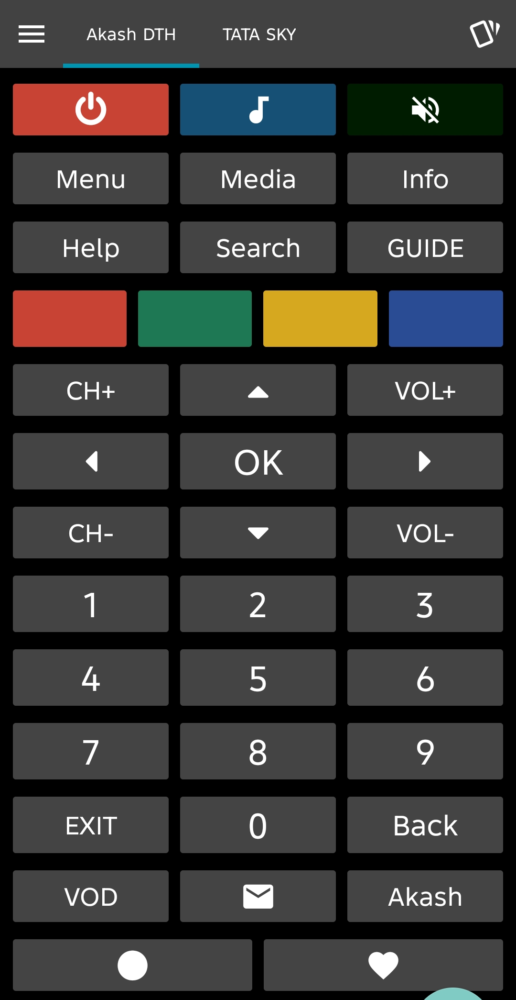
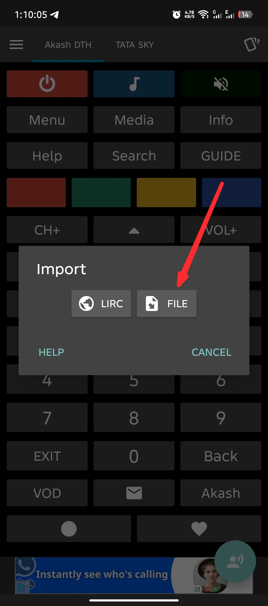

# Akash DTH IR Codes (N8784B)

This repository contains discrete infrared (IR) codes for the **Akash DTH** set-top box, specifically for the **N8784B** remote model. These codes are compatible with the **IRplus** application, allowing you to control your Akash DTH box using an IR-enabled Android device.

## Description

The **N8784B discrete infrared codes** included here provide precise control over your Akash DTH set-top box. By importing the `.irplus` file into the IRplus app, you can replicate the full functionality of the original remote on your smartphone.

- **Device:** Akash DTH Set-Top Box
- **Remote Model:** N8784B
- **Format:** IRplus (.irplus) and raw text (.txt)

## Remote UI in IRplus App

Below is the user interface of the Akash DTH remote as it appears in the IRplus application:

## How to Import into IRplus

To use these codes, follow these steps within the [IRplus App](https://play.google.com/store/apps/details?id=net.binarymode.android.irplus):

1. **Open the IRplus App** and navigate to the menu to find the import option.
2. **Select the `Akash DTH.irplus` file** from your downloaded folder.

### Import Steps:

| Step 1: Navigate to Import | Step 2: Select .irplus File |
| :---: | :---: |
|  |  |

---
*Created for the Akash DTH community.*
